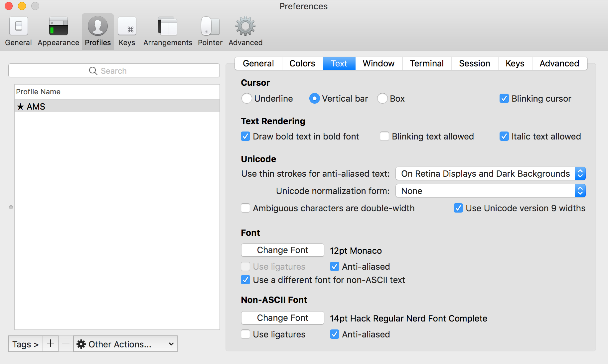
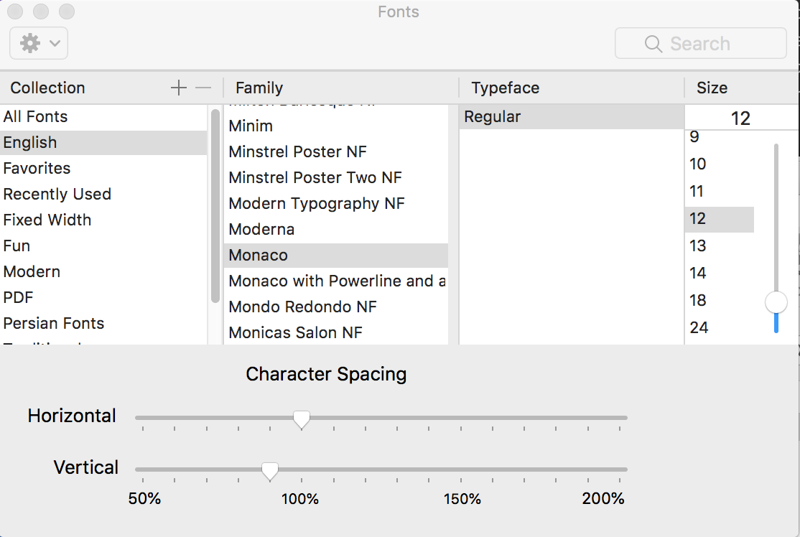

# ITerm 2 AMS Customization

Terminal CLI (Command Line Tool) has a some major upgrades too like any other technologies in every major science that has grown up, CLI has too.

With help of many NERD and GEEKS that loves to done their works with CLI from 80 ~ 90 to 21 Centeries

So In this gits I show you how to do this :)


##🗓 Requirments :

1. UNIX Based OS 😎
2. Terminal Them
3. OhMyZSH - Zprezto
4. ZSH Shell
5. Modern Terminal CLI **iTerm2 (macOS)** , **Hyper or Gnome Terminal (Linux)**
6. Edited Font
7. Settings
8. Color Scheme
9. 
10. Passion and Be Cool with Problems and issues
11. Internet for download things


## 🏁 Pre Start

We have two ZSH Framwork here :

1. Oh My Zsh
2. ZPrezto

I add zprezto because it's more simple and cool but still have oh my zsh in list because has many plugins and more compatible with Them frameworks

So if you want to start with each of them please do in that way not combination of both


## 🧐 How to install ? 

We start from order in one to the end.


### 🌍 Unix Based OS

Linux and macOS or OSX is fine but for windows, I don't test it yet, if anyone test and see the resault please contribute and pull the request


### 👽 Terminal

UNIX based OS has Terminal by default but maybe and most of the time of course it does'nt answer our need so basically we need to install another terminal to support more color - edited font - icons - schemes - themes - frameworks - glyphs - devicon - patched font - and ...

In macOS there is only and just only best terminal free open source iTerm2 

In Linux you have many choices : Gnome - XFCE - Arch  - and so on ..

Most of them is OK 👍🏻


#### iTerm2

```
brew cask install iterm2
```

Or, if you do not have homebrew (you should ;)): [Download](http://www.iterm2.com/downloads.html) and install iTerm2

iTerm2 has better color fidelity than the built in Terminal, so your themes will look better.

Get the iTerm color settings

- [Solarized Dark theme](https://raw.githubusercontent.com/mbadolato/iTerm2-Color-Schemes/master/schemes/Solarized%20Dark%20-%20Patched.itermcolors) (patched version to fix the bright black value)
- [Solarized Light theme](https://raw.githubusercontent.com/altercation/solarized/master/iterm2-colors-solarized/Solarized%20Light.itermcolors)
- [More themes @ iterm2colorschemes](http://iterm2colorschemes.com/)

Just save it somewhere and open the file(s). The color settings will  be imported into iTerm2. Apply them in iTerm through iTerm → preferences  → profiles → colors → load presets. You can create a different profile  other than `Default` if you wish to do so.


#### Linux Term

You can install most of the terminal with package installer in each linux distribution for e.g in Arch Linux you can install :

```
sudo pacman -S gnome-terminal
sudo pacman -S terminator
```


### Oh My Zsh

More Info here : [OMZ](https://github.com/robbyrussell/oh-my-zsh)

#### With Curl

```
sh -c "$(curl -fsSL https://raw.github.com/robbyrussell/oh-my-zsh/master/tools/install.sh)"
```

When the installation is done, edit `~/.zshrc` and set `ZSH_THEME="agnoster"`


#### Powerlevel9k

If you prefer the Powerlevel9k look with added info such as exit codes and timestamps on the right, run:

```
git clone https://github.com/bhilburn/powerlevel9k.git ~/.oh-my-zsh/custom/themes/powerlevel9k
```

Then edit your `~/.zshrc` and set `ZSH_THEME="powerlevel9k/powerlevel9k"`.

Powerlevel9k offers a whole lot more, best is to [check out these user made configs yourself](https://github.com/bhilburn/powerlevel9k/wiki/Show-Off-Your-Config).


####Install a patched font

- [Meslo](https://github.com/powerline/fonts/blob/master/Meslo%20Slashed/Meslo%20LG%20M%20Regular%20for%20Powerline.ttf) (the one in the screenshot). Click "view raw" to download the font.
- [Source Code Pro](https://github.com/powerline/fonts/blob/master/SourceCodePro/Source%20Code%20Pro%20for%20Powerline.otf) has better alignment for the glyphs @14px.
- [Others @ powerline fonts](https://github.com/powerline/fonts)

Open the downloaded font and press "Install Font".

Set this font in iTerm2 (14px is my personal preference) (iTerm → Preferences → Profiles → Text → Change Font).

Restart iTerm2 for all changes to take effect.


####Further tweaking

Things like

- auto suggestions
- word jumping with arrow keys / natural text editing
- shorter prompt style
- syntax highlighting
- visual studio code config

can be found in the section below.


### Auto suggestions (for Oh My Zsh)

Just follow these steps: <https://github.com/zsh-users/zsh-autosuggestions/blob/master/INSTALL.md#oh-my-zsh>

If the auto suggestions do not appear to show, it could be a problem  with your color scheme. Under "iTerm → Preferences → Colors tab", check  the value of Black Bright, that is the color your auto suggestions will  have. It will be displayed on top of the Background color. If there is  not enough contrast between the two, you won't see the suggestions even  if they're actually there..


### Enable word jumps and word deletion, aka natural text selection

By default, word jumps (option + → or ←) and word deletions (option +  backspace) do not work. To enable these, go to "iTerm → Preferences →  Profiles → Keys → Load Preset... → Natural Text Editing → Boom! Head  explodes"


###Custom prompt styles

By default, your prompt will now show “user@hostname” in the prompt. This will make your prompt rather bloated. Optionally set `DEFAULT_USER` in `~/.zshrc`  to your regular username (these must match) to hide the “user@hostname”  info when you’re logged in as yourself on your local machine. You can  get your exact username value by executing `whoami` in the terminal.

For further customisation of your prompt, you can follow a great guide here: <https://code.tutsplus.com/tutorials/how-to-customize-your-command-prompt--net-24083>


###Syntax highlighting

```
brew install zsh-syntax-highlighting
```

If you do not have or do not like homebrew, follow [the installation instructions](https://github.com/zsh-users/zsh-syntax-highlighting/blob/master/INSTALL.md) instead.

After installation through homebrew, add

```
source /usr/local/share/zsh-syntax-highlighting/zsh-syntax-highlighting.zsh
```

to **the end** of your `.zshrc` file. After that, it's best to restart your terminal. Sourcing your `~/.zshrc` does not seem to work well with this plugin.


###Visual Studio Code config

Installing a patched font will mess up the integrated terminal in VS  Code unless you use the proper settings. You'll need to go to settings  (CMD + ,) and add or edit the following values:

- for Source Code Pro: `"terminal.integrated.fontFamily": "Source Code Pro for Powerline"`
- for Meslo: `"terminal.integrated.fontFamily": "Meslo LG M for Powerline"`
- for other fonts you'll need to check the font name in Font Book.

You can also set the fontsize e.g.: `"terminal.integrated.fontSize": 14`


### Hide the local name of your terminal

you also have to override `prompt_context` ([source](http://stackoverflow.com/questions/28491458/zsh-agnoster-theme-showing-machine-name))

```
echo "prompt_context () { }" >> ~/.zshrc && source ~/.zshrc
```

Also if you didn't already override the `DEFAULT_USER` as mentioned before:

```
echo "DEFAULT_USER=\"\"" >> ~/.zshrc && source ~/.zshrc
```


I put some ``.zshrc`` here, to be more gist efficient


## Zshrc dot file examples

### For Oh My Zsh


```sh
export ZSH=$HOME/.oh-my-zsh
export DEFAULT_USER='jarvismercer'
TERM=xterm-256color
ZSH_THEME="powerlevel9k/powerlevel9k"
POWERLEVEL9K_MODE='awesome-fontconfig'

POWERLEVEL9K_PROMPT_ON_NEWLINE=true
POWERLEVEL9K_PROMPT_ADD_NEWLINE=true
POWERLEVEL9K_RPROMPT_ON_NEWLINE=true
POWERLEVEL9K_SHORTEN_DIR_LENGTH=2
POWERLEVEL9K_SHORTEN_STRATEGY="truncate_beginning"

POWERLEVEL9K_RVM_BACKGROUND="black"
POWERLEVEL9K_RVM_FOREGROUND="249"
POWERLEVEL9K_TODO_BACKGROUND="clear"
POWERLEVEL9K_TODO_FOREGROUND="white"
POWERLEVEL9K_HISTORY_BACKGROUND="clear"
POWERLEVEL9K_HISTORY_FOREGROUND="197"
POWERLEVEL9K_RAM_BACKGROUND="clear"
POWERLEVEL9K_RAM_FOREGROUND="yellow"
POWERLEVEL9K_COMMAND_EXECUTION_TIME_BACKGROUND="clear"
POWERLEVEL9K_COMMAND_EXECUTION_TIME_FOREGROUND="magenta"
POWERLEVEL9K_RVM_BACKGROUND="black"
POWERLEVEL9K_RVM_FOREGROUND="249"
POWERLEVEL9K_RVM_VISUAL_IDENTIFIER_COLOR="red"
POWERLEVEL9K_TIME_BACKGROUND="black"
POWERLEVEL9K_TIME_FOREGROUND="cyan"
POWERLEVEL9K_VCS_CLEAN_FOREGROUND='black'
POWERLEVEL9K_VCS_CLEAN_BACKGROUND='green'
POWERLEVEL9K_VCS_UNTRACKED_FOREGROUND='black'
POWERLEVEL9K_VCS_UNTRACKED_BACKGROUND='yellow'
POWERLEVEL9K_VCS_MODIFIED_FOREGROUND='white'
POWERLEVEL9K_VCS_MODIFIED_BACKGROUND='black'
POWERLEVEL9K_COMMAND_EXECUTION_TIME_BACKGROUND='black'
POWERLEVEL9K_COMMAND_EXECUTION_TIME_FOREGROUND='blue'

POWERLEVEL9K_FOLDER_ICON=''
POWERLEVEL9K_BATTERY_ICON='⚡'
POWERLEVEL9K_VCS_UNTRACKED_ICON='\u25CF'
POWERLEVEL9K_VCS_UNSTAGED_ICON='\u00b1'
POWERLEVEL9K_VCS_INCOMING_CHANGES_ICON='\u2193'
POWERLEVEL9K_VCS_OUTGOING_CHANGES_ICON='\u2191'
POWERLEVEL9K_VCS_COMMIT_ICON="\uf417"

POWERLEVEL9K_MULTILINE_FIRST_PROMPT_PREFIX="%F{blue}\u256D\u2500%F{white}"
POWERLEVEL9K_MULTILINE_SECOND_PROMPT_PREFIX="%F{blue}\u2570\uf460%F{white} "

POWERLEVEL9K_STATUS_OK_IN_NON_VERBOSE=true
POWERLEVEL9K_STATUS_VERBOSE=false
POWERLEVEL9K_COMMAND_EXECUTION_TIME_THRESHOLD=0
POWERLEVEL9K_RAM_ELEMENTS=(ram_free)
POWERLEVEL9K_TIME_FORMAT="\UF43A %D{%H:%M  \UF133  %d.%m.%y}"
POWERLEVEL9K_STATUS_VERBOSE=false

POWERLEVEL9K_LEFT_PROMPT_ELEMENTS=(context root_indicator os_icon ssh todo dir dir_writable rbenv vcs)
POWERLEVEL9K_RIGHT_PROMPT_ELEMENTS=(status command_execution_time background_jobs history  rvm time battery ram)

ENABLE_CORRECTION="false"
HIST_STAMPS="mm/dd/yyyy"

plugins=(git git-extras gem bundler osx ruby rvm rails sudo sublime colorize history history-substring-search last-working-dir compleat zsh-completions zsh-history-substring-search zsh-autosuggestions zsh-syntax-highlighting zsh-syntax-highlighting-filetypes warhol)
autoload -U compinit && compinit

source $ZSH/oh-my-zsh.sh
bindkey '\e[A' history-beginning-search-backward
bindkey '\e[B' history-beginning-search-forward

export CLICOLOR=1
export LSCOLORS=gxBxhxDxfxhxhxhxhxcxcx
```


### For ZPrezto

```sh
# Re Written by AMS-H4CK3R AND JARVIS-AI from base to be complete customization in zsh with
# prezto framework and POWERLEVEL9K template and AMS schema plate (ITS MY PLATE)
# With CUSTOME Font Pached With POWERLINE.
# All Right Reserved and this configuration file is under GNU Licence and You
# Can edit it and share it.
# Also I added this code to the GITHUB Project so you can go there and give me
# A PITTY Star if you like it.
# Thanks for reading and coding.
# Coding Date : 26 Aug 2017 - 10/May/2018 (In MacOS)
# Finished Date : 28 Aug 2017
# Code with : Atom + Sublime + XFCE Terminal + Gnome Terminal + Konsole + iTerm2
# My OS : Arch Linux + Mint Linux + macOS High Sierra + Kali (Debian)
# Shell : ZSH OR Z Shell
# Copyright c All Rights Reserved in 2017.
# If you have any problem with this you can contact this email :
# ams.h4ck3r@gmail.com


## *********
# NOTE NOTE NOTE NOTE
# THIS ONE IS FOR MAC OS APPLE AND DESIGNED FOR IT NOT FOR WINDOWS OR LINUX
## *********


# Lines configured by zsh-newuser-install
HISTFILE=~/.histfile
HISTSIZE=100000
SAVEHIST=100000
setopt beep
unsetopt appendhistory
bindkey -e
# End of lines configured by zsh-newuser-install


# The following lines were added by compinstall
zstyle :compinstall filename '/Users/jarvismercer/.zshrc'

autoload -Uz compinit
compinit
# End of lines added by compinstall


# HomeBrew Configs
export PATH="/usr/local/opt/gettext/bin:$PATH"
export PATH="/usr/local/opt/openssl/bin:$PATH"
export PATH="$HOME/.jenv/bin:$PATH"
eval "$(jenv init -)"
# End of HomeBrew Configs


# Aliases ZSH
# alias ls="ls --color=always -FG"
alias gr="grep --exclude-dir=build --exclude-dir=swig --exclude-dir=.git --exclude=tags --exclude=TAGS --exclude-dir=site --exclude-dir=.deps
-rniI "
# alias h="history | grep "
alias tree="git log --graph --decorate --pretty=oneline --abbrev-commit"
# End of Aliases ZSH


# ----------------------
# Custome JARVIS Aliases
# ----------------------
alias cls='clear'
alias AMS='uname -a'
alias DIR='dir'
alias CD='cd'
alias LS='ls'
alias ll='ls -a'
alias lll='ls -la'
alias cat='ccat'
alias llll='ls -la -x'
alias Hello='echo "Hello, How are you JARVIS today ? Are you OK to do WORKS ??!"'
alias YES='echo "So then check your permissions for this system for HACKING Ohter systems if you want to hack systems :D ???"'
alias htr='httrack'
alias mkr='mkdir'
alias wg='wget -rkp'
alias wg2='wget -rkp -m --random-wait -e robots=off -U Mozilla -l 0 -o LOGed.txt -v -d'
alias wg3='wget -rkp -e robots=off -o LOGed.log -v'
alias mic='micro'
# ----------------------

# Zprezto Config Initialization
source "${ZDOTDIR:-$HOME}/.zprezto/init.zsh"

# ZSH Auto Suggesstions
source /usr/local/share/zsh-autosuggestions/zsh-autosuggestions.zsh


# PowerLevel9K Config
# ================================================
# POWERLEVEL9K_MODE='awesome-fontconfig'
# POWERLEVEL9K_MODE='nerdfont-fontconfig'

export DEFAULT_USER=jarvis-ai

POWERLEVEL9K_LEFT_PROMPT_ELEMENTS=('root_indicator' 'os_icon' 'todo' 'dir' 'dir_writable' 'rbenv' 'vcs')
POWERLEVEL9K_RIGHT_PROMPT_ELEMENTS=('status' 'background_jobs' 'command_execution_time' 'history' 'time' 'battery' 'ram')

POWERLEVEL9K_OS_ICON="$(print_icon 'APPLE_ICON')"
POWERLEVEL9K_APPLE_ICON='\uF179'
POWERLEVEL9K_OS_ICON=''
# POWERLEVEL9K_APPLE_ICON=''
POWERLEVEL9K_FREEBSD_ICON='\U1F608'
POWERLEVEL9K_DISK_ICON='\uF0A0 '
POWERLEVEL9K_EXECUTION_TIME_ICON='\uF252'
POWERLEVEL9K_LINUX_ICON='\uF17C'
POWERLEVEL9K_BATTERY_ICON='\UF240'
POWERLEVEL9K_LOCK_ICON='\UE0A2'
POWERLEVEL9K_HOME_ICON='\uF015'
# POWERLEVEL9K_ROOT_ICON='⚡'
# POWERLEVEL9K_FAIL_ICON='✘'
# POWERLEVEL9K_OK_ICON='✔'
POWERLEVEL9K_BACKGROUND_JOBS_ICON='⚙'
POWERLEVEL9K_VCS_GIT_ICON='\ue60a'
POWERLEVEL9K_VCS_COMMIT_ICON='➦ '
POWERLEVEL9K_VCS_STAGED_ICON='\u00b1'
POWERLEVEL9K_VCS_UNTRACKED_ICON='\u25CF'
POWERLEVEL9K_VCS_UNSTAGED_ICON='\u00b1'
POWERLEVEL9K_VCS_INCOMING_CHANGES_ICON='\u2193'
POWERLEVEL9K_VCS_OUTGOING_CHANGES_ICON='\u2191'
POWERLEVEL9K_FOLDER_ICON=''
POWERLEVEL9K_HOME_SUB_ICON=" $(print_icon "HOME_ICON")"
POWERLEVEL9K_DIR_PATH_SEPARATOR=" $(print_icon "LEFT_SUBSEGMENT_SEPARATOR") "

POWERLEVEL9K_TIME_FORMAT="%D{%H:%M} \uF015"
POWERLEVEL9K_TIME_BACKGROUND='clear'
POWERLEVEL9K_TIME_FOREGROUND='white'

POWERLEVEL9K_STATUS_VERBOSE=false
POWERLEVEL9K_STATUS_OK_IN_NON_VERBOSE=true

POWERLEVEL9K_BACKGROUND_JOBS_VERBOSE=true

POWERLEVEL9K_SHORTEN_STRATEGY="truncate_middle"
POWERLEVEL9K_SHORTEN_DIR_LENGTH=3

POWERLEVEL9K_VCS_MODIFIED_BACKGROUND="clear"
POWERLEVEL9K_VCS_UNTRACKED_BACKGROUND="clear"
POWERLEVEL9K_VCS_MODIFIED_FOREGROUND="yellow"
POWERLEVEL9K_VCS_UNTRACKED_FOREGROUND="yellow"

POWERLEVEL9K_DIR_HOME_BACKGROUND="clear"
POWERLEVEL9K_DIR_HOME_FOREGROUND="39"
POWERLEVEL9K_DIR_HOME_SUBFOLDER_BACKGROUND="clear"
POWERLEVEL9K_DIR_HOME_SUBFOLDER_FOREGROUND="45"
POWERLEVEL9K_DIR_WRITABLE_FORBIDDEN_BACKGROUND="clear"
POWERLEVEL9K_DIR_WRITABLE_FORBIDDEN_FOREGROUND="red"
POWERLEVEL9K_DIR_DEFAULT_BACKGROUND="clear"
POWERLEVEL9K_DIR_DEFAULT_FOREGROUND="red"

POWERLEVEL9K_STATUS_OK_BACKGROUND="clear"
POWERLEVEL9K_STATUS_OK_FOREGROUND="46"
POWERLEVEL9K_STATUS_ERROR_BACKGROUND="clear"
POWERLEVEL9K_STATUS_ERROR_FOREGROUND="red"

POWERLEVEL9K_COMMAND_EXECUTION_TIME_BACKGROUND='clear'
POWERLEVEL9K_COMMAND_EXECUTION_TIME_FOREGROUND='blue'

POWERLEVEL9K_BACKGROUND_JOBS_BACKGROUND='clear'
POWERLEVEL9K_BACKGROUND_JOBS_FOREGROUND='green'

POWERLEVEL9K_ROOT_INDICATOR_BACKGROUND="clear"
POWERLEVEL9K_ROOT_INDICATOR_FOREGROUND="190"
POWERLEVEL9K_CONTEXT_ROOT_BACKGROUND="clear"
POWERLEVEL9K_CONTEXT_ROOT_FOREGROUND="red"

POWERLEVEL9K_RIGHT_SEGMENT_SEPARATOR=''
POWERLEVEL9K_RIGHT_SUBSEGMENT_SEPARATOR=''

POWERLEVEL9K_LEFT_SEGMENT_SEPARATOR=''
POWERLEVEL9K_LEFT_SUBSEGMENT_SEPARATOR=''

POWERLEVEL9K_BATTERY_LOW_THRESHOLD='10'
POWERLEVEL9K_BATTERY_CHARGED='green'
POWERLEVEL9K_BATTERY_LOW_BACKGROUND="clear"
POWERLEVEL9K_BATTERY_CHARGING_BACKGROUND="clear"
POWERLEVEL9K_BATTERY_CHARGED_BACKGROUND="clear"
POWERLEVEL9K_BATTERY_DISCONNECTED_BACKGROUND="clear"
POWERLEVEL9K_BATTERY_DISCONNECTED_FOREGROUND="249"

POWERLEVEL9K_RAM_BACKGROUND="clear"
POWERLEVEL9K_RAM_FOREGROUND="cyan"
POWERLEVEL9K_RAM_ELEMENTS=(ram_free)
POWERLEVEL9K_RAM_ICON="⚡"

POWERLEVEL9K_TODO_BACKGROUND="clear"
POWERLEVEL9K_TODO_FOREGROUND="white"

POWERLEVEL9K_OS_ICON_BACKGROUND="clear"
POWERLEVEL9K_OS_ICON_FOREGROUND="247"

POWERLEVEL9K_HISTORY_BACKGROUND="clear"
POWERLEVEL9K_HISTORY_FOREGROUND="197"

POWERLEVEL9K_CUSTOM_PID='echo -e "\uf258  $$ \uf258  `date +%D` \uf168"'
POWERLEVEL9K_CUSTOM_PID_BACKGROUND="clear"
POWERLEVEL9K_CUSTOM_PID_FOREGROUND="white"

POWERLEVEL9K_CUSTOM_TTY="tty"
POWERLEVEL9K_CUSTOM_TTY_BACKGROUND="clear"
POWERLEVEL9K_CUSTOM_TTY_FOREGROUND="white"

POWERLEVEL9K_COMMAND_EXECUTION_TIME_THRESHOLD=1
POWERLEVEL9K_COMMAND_EXECUTION_TIME_PRECISION=3
POWERLEVEL9K_COMMAND_EXECUTION_TIME_THRESHOLD=0

POWERLEVEL9K_PROMPT_ON_NEWLINE=true

POWERLEVEL9K_DIR_OMIT_FIRST_CHARACTER=true
# ------------------------------------------------

# NVM Configs
export NVM_DIR="$HOME/.nvm"
[ -s "$NVM_DIR/nvm.sh" ] && \. "$NVM_DIR/nvm.sh"  # This loads nvm
[ -s "$NVM_DIR/bash_completion" ] && \. "$NVM_DIR/bash_completion"  # This loads nvm bash_completion


# Ruby Version Manager
export PATH="$HOME/.rbenv/bin:$PATH"
eval "$(rbenv init -)"

# Sqlite
export PATH="/usr/local/opt/sqlite/bin:$PATH"

# XML Catalog
export XML_CATALOG_FILES="/usr/local/etc/xml/catalog"

# Sphinx Dox
# export PATH="/usr/local/opt/sphinx-doc/bin:$PATH"

# GoROOT
export PATH=$PATH:/usr/local/opt/go/libexec/bin

# QT
export PATH="/Users/jarvismercer/.qt/Qt5.11.1/5.11.1/clang_64/bin:$PATH"

# Perl6 Rakudo
export PATH=$PATH:/Applications/Rakudo/bin:/Applications/Rakudo/share/perl6/site/bin

# OpenSSL
export PATH="/usr/local/opt/openssl/bin:$PATH"

#CCTOOLS
export PATH="/usr/local/opt/cctools/bin:$PATH"

# OPAM by OCaml
test -r /Users/jarvismercer/.opam/opam-init/init.zsh && . /Users/jarvismercer/.opam/opam-init/init.zsh > /dev/null 2> /dev/null || true

# MANPAGE of erlang
MANPATH=/usr/local/opt/erlang/lib/erlang/man:$MANPATH

# Scala
export PATH="/usr/local/opt/scala/idea:$PATH"

# Python Version Manager PYENV
export PYENV_ROOT="$HOME/.pyenv"
export PATH="$PYENV_ROOT/bin:$PATH"
eval "$(pyenv init -)"
# PYENV VIRTUALENV
eval "$(pyenv virtualenv-init -)"


#MacPort
# export PATH=/opt/local/bin:/opt/local/sbin:$PATH


# Custom command in UNIX Mac Linux By Myself
# Create a Folder in your Home Directory and name it yourself
# Put your codes in there and export the path directory in your Shells config
# ================================================

export PATH="/Users/jarvismercer/My_Commands_UNIX/bin:$PATH"
```


## My favorite color

My favorite color for Terminal color
Specially iTerm2

Set 1

| Color Name |        |
| :--------: | :----: |
|   Black    | 000000 |
|    Red     | f25968 |
|   Green    | 69f63c |
|   Yellow   | fac761 |
|    Blue    | 7998b6 |
|  Magenta   | b48ea6 |
|    Cyan    | 98f9f6 |
|   White    | c0c5ce |


Set 2

|  Color  | Color Code |
| :-----: | :--------: |
|  Black  |   2c3e50   |
|   Red   |   f25968   |
|  Green  |   c7f259   |
| Yellow  |   fac761   |
|  Blue   |   7998b6   |
| Magenta |   ff8600   |
|  Cyan   |   98f9f6   |
|  White  |   c0c5ce   |

## Some Picture for better understanding







## Completed Terminal Demo

